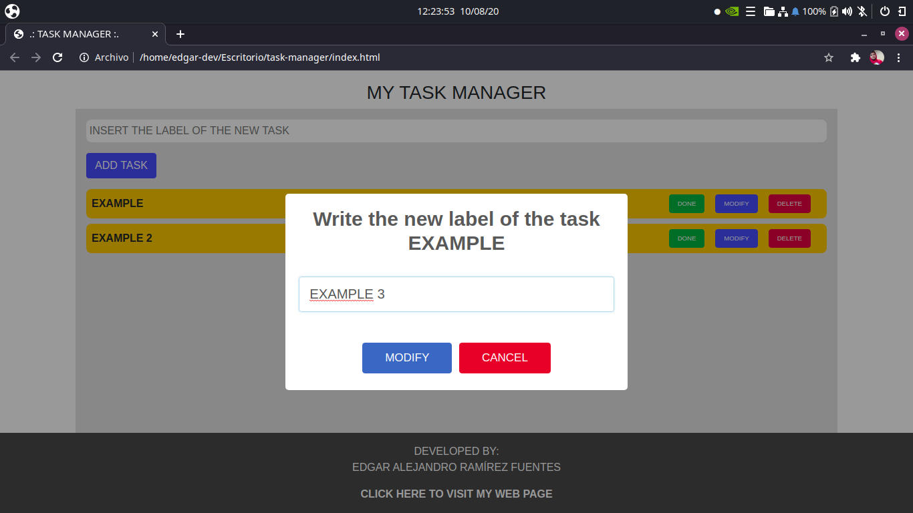

# Task manager

## Table of Contents

- [About](#about)
- [Web page](#page)
- [Usage](#usage)

## About 

I created this application to satisfy a need I had in 2019, which was trying to manage my tasks I had pending and get more responsible.
This app was built using some web development technologies such as: HTML, JavaScript and CSS.
I used localstorage to try to simulate a database and save all the information about my pending tasks.

## Web page 

This project is currently on a server, so you can give it a try.    
[Try Task Manager](https://taskmanager-earf.netlify.app/)  

## Usage 

### **User Interface**

### **Add a new task**

To add a new task you need to write the label of the task in the input field and click on the button labeled as "ADD TASK".  

  

Once you clicked on the button, you will get a notification that tells you that the task was added successfully and your task will show up in the list as a pending task.

If the label you wrote already exists, a warning notice will show up.

If you click on the button labeled as "ADD TASK" without writing the label of the new task, an error notice will show up.

### **Modify the label of a task**
To change the label of a task, you need to click on the button labeled as "MODIFY" in the task you want to modify and a window will show up.

Once you wrote the new label of the task, you need to click on the button labeled as "MODIFY" to change the label.

If you try to modify a task without writing the new label of the task a error message will show up.

If the label you are trying to add already exists, the application will warn you about it and the change will not be done.

### **Delete a task**

To delete a task, you only need to click on the button labeled as "DELETE" and confirm in the window that will show up.

### **Order the tasks**

If you want to give an specific order to your tasks, you only need to grab the task you want change its order and put it on the position you want.

